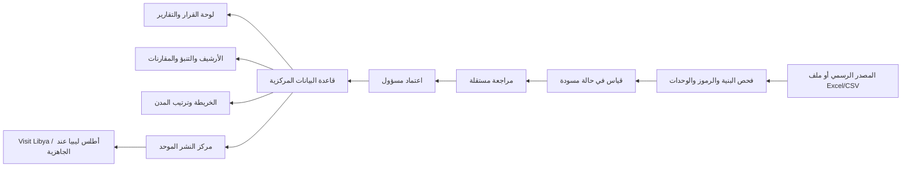
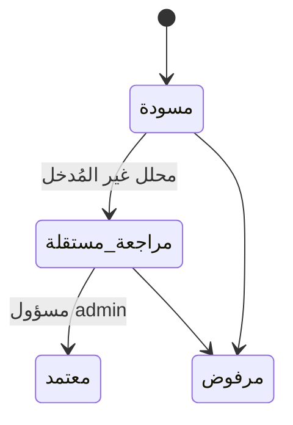

# التقرير التشغيلي التفصيلي لمنصة المرصد الوطني للإحصاءات والمؤشرات السياحية

**الإصدار:** تقرير تشغيلي ووصفي للمنظومة الحالية  
**الجهة المرجعية للبيانات التاريخية:** مركز المعلومات والتوثيق السياحي  
**حالة التقرير:** يصف ما هو منفذ فعلياً في المنصة، وما هو متاح من بيانات، وما يبقى بانتظار مصدر رسمي.

---

## 1. الملخص التنفيذي

المنصة هي **مرصد وطني موحد للبيانات والإحصاءات والمؤشرات السياحية**. هدفها أن تصبح قاعدة البيانات المركزية التي تغذي لوحة القرار، والتقارير الحكومية، وواجهات النشر المخصصة لـ **Visit Libya** و**أطلس ليبيا**، مع حفظ مصدر كل قياس وحالة مراجعته واعتماده. لا تتعامل المنصة مع الرقم بوصفه مجرد قيمة في جدول؛ بل تربطه بالمؤشر والسنة والوحدة والمصدر والحالة والمسؤول عن الإدخال والتحقق.

تعمل المنصة اليوم بثلاث طبقات مترابطة: طبقة بيانات وطنية تاريخية، وطبقة إدارة مؤشرات وقياسات، وطبقة مكانية خاصة بالمدن السياحية. وفيها أيضاً استيراد من Excel وCSV، تقارير PDF وExcel، تنبؤات حسابية شفافة، إدارة أدوار، أرشيف تاريخي، ومركز نشر موحد. تعتمد بنية المؤشرات المحاور الاقتصادية والاجتماعية والبيئية، وتربط المؤشر بإطار UN Tourism أو أهداف التنمية المستدامة SDG بحسب طبيعته. ويعكس هذا التنظيم منهج قياس السياحة المستدامة الذي يجمع الأبعاد الاقتصادية والاجتماعية والبيئية في إطار إحصائي واحد.[1]

> **القاعدة الحاكمة للمنصة:** لا تُدخل قيمة تاريخية أو مكانية على أنها معتمدة إلا إذا كانت لها سنة مرجعية واضحة، وقيمة محددة، ووحدة متسقة، ومصدر رسمي قابل للتتبع. لا تتحول الفجوات إلى أصفار، ولا تُعامل التوقعات أو البيانات الربع سنوية والنصف سنوية كقياسات سنوية كاملة.

| محور | الحالة الحالية |
|---|---:|
| المؤشرات المنشورة في القاموس | 23 مؤشراً |
| القياسات الوطنية السنوية المعتمدة | 179 قياساً |
| امتداد السلسلة الوطنية | 1994–2025 |
| المؤشرات التاريخية الموحدة | 20 مؤشراً |
| القياسات المكانية المعتمدة للمدن | 0 حالياً |
| المدن المهيأة في العرض المكاني | طرابلس، بنغازي، سبها |
| اختبارات البرنامج الناجحة | 52 اختباراً في 27 ملف اختبار |

---

## 2. لماذا توجد المنصة؟ وما المشكلة التي تحلها؟

قبل وجود المرصد الموحد، تكون البيانات عادة موزعة بين ملفات وتقارير ومصادر متفرقة، ويصعب معرفة أي رقم هو الأحدث، أو ما مصدره، أو هل هو سنوي أم جزئي، أو هل تم اعتماده. المنصة تعالج ذلك من خلال **مصدر مركزي واحد للحقيقة**: لكل مؤشر تعريف موحد، ولكل قياس سجل مصدر وحالة، ولكل عملية استيراد سجل مراجعة، ولكل قرار اعتماد أثر تدقيقي.

تدعم المنصة الاستخدامات التالية:

| المستفيد | الاستخدام داخل المنصة |
|---|---|
| مركز المعلومات والتوثيق السياحي | إدارة المؤشرات، إدخال القياسات، اعتماد المصادر، الأرشيف، وتدقيق الجودة. |
| صانع القرار | لوحة مؤشرات، أداء مقابل المستهدف، مقارنة مؤشرات، وتقارير قابلة للتصدير. |
| المحلل الإحصائي | استيراد منظم، تدقيق صفوف، مراجعة بيانات، تنبؤات، ومقارنات زمنية. |
| المستخدم القارئ | الاطلاع على المؤشرات والرسوم والتقارير المعتمدة حسب صلاحياته. |
| Visit Libya وأطلس ليبيا | حزم نشر معدة من المصدر الموحد، ولا تُتاح إلا عند جاهزية وجهة النشر. |

---

## 3. البنية المنطقية والتقنية للمنصة

المنصة مبنية كمنظومة ويب مؤسسية عربية من اليمين إلى اليسار. الواجهة تستخدم React، والخادم يستخدم Express وtRPC، وقاعدة البيانات MySQL/TiDB عبر Drizzle ORM. لا يحتاج المستخدم إلى معرفة هذه التفاصيل البرمجية للتشغيل اليومي، لكنها تضمن أن النماذج، والصلاحيات، والتحقق، والبيانات تعمل بعقود واضحة بين الواجهة والخادم.



### 3.1 الوحدات الرئيسة

| الوحدة | وظيفتها العملية |
|---|---|
| لوحة المؤشرات | تعرض ملخص المؤشرات والقياسات المعتمدة، مع فلاتر السنة والمحور والإطار وSDG. |
| إدارة المؤشرات | إنشاء وتعديل ونشر وأرشفة تعريفات المؤشرات ووحداتها ومراجعها. |
| إدخال البيانات | إدخال قياس وهدف ومصدر وملاحظات مع تحقق فوري حسب وحدة القياس. |
| الاستيراد | قبول Excel وCSV فقط، فحص الصفوف، حفظ الأخطاء، وإدخال الصفوف السليمة كمسودات. |
| التنبؤ | حساب توقعات سنوية من قياسات سنوية معتمدة فقط، مع فصل واضح بين الفعلي والمتوقع. |
| المقارنات | مقارنة مؤشرين أو أكثر ضمن نطاق عام أو سنة. |
| الأرشيف التاريخي | عرض تغطية السنوات، الفجوات، السلاسل التاريخية، وسجل المصادر. |
| المدن السياحية | خريطة مدن، فلاتر، ترتيب حسب الفئات، صفحة تفصيل، وتغير زمني عند توفر قياسات مكانية. |
| إدارة البيانات المكانية | تعريف المدن والحدود المرجعية، وإدخال القياسات المكانية ومراجعتها واعتمادها. |
| التقارير والتصدير | تصدير PDF وExcel للبيانات والتقارير، وPDF/PNG لملخص المدن. |
| مركز النشر الموحد | تجهيز حزم بيانات لوجهات Visit Libya وأطلس ليبيا مع بوابة جاهزية قبل الإتاحة. |
| المستخدمون والصلاحيات | إدارة الأدوار الثلاثة ومجال الوصول لكل مستخدم. |

---

## 4. نموذج البيانات: ما الذي يُخزن داخل المرصد؟

### 4.1 الجداول والمفاهيم الأساسية

| الكيان | أهم ما يحتويه | الغرض |
|---|---|---|
| `users` | المستخدم، الاسم، الدور | ضبط المسؤوليات والصلاحيات. |
| `indicators` | الرمز، الاسم، المحور، الإطار، SDG، الوحدة، طريقة الاحتساب، المصدر، حالة النشر | قاموس المؤشرات الموحد. |
| `indicatorObservations` | المؤشر، السنة، الفترة، القيمة، الهدف، المصدر، الحالة، المدخل، المراجع | القياسات الوطنية الزمنية. |
| `importJobs` و`importIssues` | الملف، نوعه، الصفوف المقبولة والمرفوضة، سبب الخطأ | أثر تدقيقي كامل للاستيراد. |
| `spatialAreas` | المدينة أو السجل الإداري، رمزها، مرجع الحد، حالة توثيق الحد | المرجع المكاني. |
| `spatialObservations` | المدينة، المؤشر، السنة، القيمة، المصدر، حالة المراجعة | القياسات المنسوبة إلى المدن. |
| `spatialObservationReviewEvents` | الحالة السابقة واللاحقة، المراجع، الوقت، الملاحظة | سجل تدقيق دورة المراجعة المكانية. |
| `publicationDestinations` | الوجهة، الحالة، المسؤول، تاريخ التحديث | منع النشر الخارجي قبل الاعتماد. |

### 4.2 تعريف القياس

القياس ليس رقماً فقط. لكي يكون قابلاً للاستخدام، يجب أن يحمل الحقول التالية:

| الحقل | مثال | لماذا هو مهم؟ |
|---|---|---|
| المؤشر | عدد السياح الدوليين | يحدد معنى الرقم. |
| السنة والفترة | 2025، سنوية | تمنع خلط السنة بالربع أو النصف. |
| القيمة والوحدة | 12,500 زائر | تمنع خلط العدد بالقيمة المالية أو النسبة. |
| الهدف | 14,000 زائر | يستخدم فقط عند وجود مستهدف رسمي. |
| المصدر | التقرير الإحصائي 2025، صفحة محددة | يثبت قابلية التتبع. |
| الحالة | مسودة / مراجَع / معتمد / مرفوض | تحدد إن كان الرقم يظهر في القرار والنشر. |
| المدخل والمراجع | المستخدم والتاريخ | يحقق المساءلة والتدقيق. |

---

## 5. دورة حياة البيانات: من الملف إلى لوحة القرار

### 5.1 الإدخال اليدوي

عند اختيار المؤشر، تظهر بطاقة تعريفية توضح الاسم، المحور، الإطار المرجعي، مرجع SDG، الوحدة، وطريقة الاحتساب. يدخل المحلل القيمة والسنة والفترة والمصدر، ثم يحفظ القياس. لا يصبح القياس معتمداً تلقائياً؛ يدخل أولاً في حالة **مسودة**.

### 5.2 الاستيراد من Excel وCSV

المنصة تقبل نوعين فقط: **Excel وCSV**. بعد رفع الملف، يجري الفحص التالي قبل إنشاء القياسات:

1. التحقق من وجود رمز المؤشر في قاموس المؤشرات.
2. التحقق من السنة والفترة والربع.
3. التحقق من أن القياس السنوي يحمل `annual`، وأن القياس الربع سنوي يحدد Q1 أو Q2 أو Q3 أو Q4.
4. التحقق من القيمة ووحدتها.
5. إنشاء سجل عملية الاستيراد، وسجل للأخطاء لكل صف مرفوض.
6. إدخال الصفوف السليمة في حالة **مسودة** وليس في حالة اعتماد.

> الاستيراد لا يساوي الاعتماد. وظيفته إدخال منظم قابل للمراجعة، بينما الاعتماد هو قرار جودة ومصدر وصلاحية.

### 5.3 القواعد المطبقة على القيم

| نوع الوحدة | القاعدة |
|---|---|
| نسبة مئوية | من 0 إلى 100، مع دقة 0.01. |
| عدد مثل زائر أو سائح أو غرفة أو منشأة أو وظيفة | عدد صحيح غير سالب. |
| قيمة مالية مثل دينار ليبي أو دولار | قيمة غير سالبة حتى منزلتين عشريتين. |
| كمية عامة | قيمة رقمية غير سالبة. |

ترفض المنصة القيمة غير الرقمية، أو السالبة، أو النسبة فوق 100، أو العدد الكسري عندما تكون الوحدة عدداً صحيحاً.

---

## 6. المراجعة والاعتماد والضوابط

### 6.1 الأدوار

| الدور | ما يستطيع فعله |
|---|---|
| `viewer` | الاطلاع على الصفحات والبيانات المعتمدة المسموح بها. |
| `analyst` | إدخال القياسات، استيراد الملفات، وإجراء مراجعة مستقلة للقياسات المكانية. |
| `admin` | إدارة المؤشرات والمستخدمين والمدن والحدود، الاعتماد النهائي، الحذف، وإدارة وجهات النشر. |

### 6.2 المسار الوطني

القياس الوطني يدخل مسودة ثم يمكن تغيير حالته إلى مراجَع أو معتمد أو مرفوض بحسب الصلاحيات المطبقة. القياسات المعتمدة هي التي تستخدم في لوحات القرار والتقارير والأرشيف والتنبؤ.

### 6.3 المسار المكاني الثنائي

لقياسات المدن يوجد قيد أقوى لمنع اعتماد الفرد لبياناته بنفسه:



* لا يستطيع مُدخل القياس تحويل قياسه هو إلى «مراجعة مستقلة».
* لا يستطيع المحلل اعتماد قياس للنشر؛ الاعتماد النهائي محصور بدور `admin`.
* لا يمكن الاعتماد قبل إتمام المراجعة.
* يسجل النظام كل انتقال حالة: من أي حالة، إلى أي حالة، من قام به، متى، وما ملاحظته.

---

## 7. المعايير والأطر المرجعية

### 7.1 UN Tourism وقياس استدامة السياحة

تصنيف المؤشرات وفق المحاور الاقتصادي والاجتماعي والبيئي يتوافق مع منظور قياس استدامة السياحة الذي يدمج هذه الأبعاد في مرجع إحصائي واحد.[1] هذا لا يعني أن كل مؤشر في المنصة هو بالضرورة مؤشر عالمي منشور بذاته؛ بل يعني أن تعريفه وهيكلته قابلة للربط بهذا الإطار عند اختيار الإطار المرجعي المناسب.

### 7.2 أهداف التنمية المستدامة

تدعم المنصة ربط المؤشرات بالغايات SDG 8 و11 و12 و14 و17. يظهر مرجع SDG داخل تعريف المؤشر، ويمكن استخدامه كفلتر في لوحة القرار. وتحدد الأمم المتحدة بيانات وصفية رسمية لإطار المؤشرات العالمي، كما تتولى UN Tourism أدواراً محددة في مؤشرات السياحة ضمن هذا الإطار.[2] [3]

| الهدف | استخدامه في المنصة |
|---|---|
| SDG 8 | الاقتصاد السياحي، العمل، الاستثمار، والمساهمة الاقتصادية. |
| SDG 11 | المواقع السياحية الموثقة، التراث، والمدن المستدامة. |
| SDG 12 | أنماط الإنتاج والاستهلاك المستدامة عند توافر المؤشرات الرسمية. |
| SDG 14 | السياحة الساحلية والبحرية عند توافر السلاسل الموثقة. |
| SDG 17 | الحوكمة، الشراكات، تبادل البيانات، والنشر الموحد. |

### 7.3 معايير المصدر والجودة

المصدر التشغيلي للبيانات التاريخية هو [صفحة الإصدارات الرسمية لمركز المعلومات والتوثيق السياحي](https://tidc.com.ly/releases.php?page=1).[4] لا تدعي المنصة حكماً قانونياً بشأن حقوق النشر؛ إنما تحفظ الرابط والتقرير والصفحة بوصفها دليل إسناد تشغيلي للقياس.

---

## 8. المعادلات والحسابات التي تطبقها المنصة

### 8.1 الأداء مقابل المستهدف

عند وجود قيمة فعلية `A` وهدف رسمي غير صفري `T` للسنة ذاتها، تحسب المنصة:

```text
الفجوة (Variance) = A − T
نسبة الإنجاز (Attainment %) = round((A / T) × 100, إلى منزلة عشرية)
الحالة = محقق إذا كانت نسبة الإنجاز ≥ 100%، وإلا دون المستهدف
```

تستخدم المنصة **أحدث قياس سنوي** له هدف صالح لكل مؤشر، ولا تحسب نسبة إنجاز إذا كان الهدف صفراً أو غير موجود.

### 8.2 التنبؤ السنوي

التنبؤ ليس قياساً فعلياً ولا يدخل في الأرشيف. تستخدم المنصة قياسين سنويين معتمدين على الأقل، وتفصل الخط الفعلي عن خط التوقع في الرسم.

إذا كانت قيمة أول سنة `V₀`، وقيمة آخر سنة `Vₙ`، والفارق بين السنتين `n`:

```text
معدل النمو السنوي المركب CAGR = (Vₙ / V₀)^(1/n) − 1
القيمة المتوقعة بعد t سنوات = Vₙ × (1 + r)^t
```

حيث `r` هو معدل CAGR التاريخي، أو معدل مخصص يدخله المستخدم. الشروط هي:

| الشرط | المعالجة |
|---|---|
| أقل من قياسين سنويين معتمدين | لا يسمح بحساب التنبؤ. |
| أول أو آخر قيمة غير موجبة | لا يسمح بحساب CAGR. |
| معدل مخصص | يقبل من -99% إلى 200% في الواجهة والخادم. |
| جودة السلسلة | مرتفعة عند 6 قياسات تاريخية فأكثر، متوسطة عند 3–5، ومحدودة عند قياسين. |

### 8.3 ترتيب المدن السياحية

لا تنتج المنصة «درجة سياحية عامة» لأن ذلك قد يخلط وحدات غير قابلة للجمع، مثل عدد الزوار وقيمة الاستثمار وعدد المرشدين. بدلاً من ذلك، توجد ثماني فئات مستقلة:

| الفئة | المؤشر المرتبط |
|---|---|
| الخدمات السياحية | مؤشر الخدمات/المنشآت المنشور المطابق. |
| المواقع السياحية | `SPATIAL-TOURISM-SITES-COUNT` — عدد المواقع السياحية الموثقة. |
| الزوار | مؤشر الزوار المنشور المطابق. |
| السياح | مؤشر السياح المنشور المطابق. |
| المرشدون | مؤشر المرشدين المنشور المطابق. |
| العمالة | مؤشر العمالة المنشور المطابق. |
| الشركات والمكاتب | مؤشر الشركات/المكاتب المنشور المطابق. |
| الاستثمار السياحي | `SPATIAL-TOURISM-INVESTMENT-LYD` — قيمة الاستثمار السياحي المعتمد. |

آلية الترتيب لكل فئة هي:

1. اختيار **مؤشر واحد فقط** للفئة.
2. أخذ أحدث قياس سنوي معتمد لكل مدينة لذلك المؤشر.
3. ترتيب المدن تنازلياً حسب القيمة.
4. عند تعادل القيمة، يستخدم اسم المدينة كفاصل عرضي ثابت.

وبصيغة مبسطة:

```text
Rank(city, year, indicator) = 1 + عدد المدن التي قيمتها المعتمدة أكبر من قيمة المدينة
```

لذلك لا يظهر ترتيب لطرابلس أو لأي مدينة حالياً؛ لأن عدد القياسات المكانية المعتمدة يساوي صفراً، وليس لأن المنصة استبعدت المدينة.

### 8.4 التغير الزمني لترتيب المدينة

عند توافر بيانات سنوات متعددة لفئة محددة، تجمع المنصة القياسات حسب السنة، وتحسب رتبة كل مدينة داخل السنة نفسها وداخل المؤشر نفسه، ثم تعرض رسم قيمة ورسم/ملخص رتبة عبر الزمن. لا ترسم المنصة خطاً تقديرياً عند غياب نقطة سنوية معتمدة.

---

## 9. الأرشيف التاريخي والبيانات المتاحة فعلياً

### 9.1 ما هو موجود الآن؟

| بند | الوضع الفعلي |
|---|---|
| القياسات الوطنية المعتمدة | 179 قياساً سنوياً |
| النطاق الزمني | 1994–2025 |
| سنوات موثقة داخل النطاق | 28 سنة |
| سنوات ظاهرة كفجوات | 5 سنوات، ومن بينها 2017–2020 في السلسلة المستوردة |
| قياسات تقرير 2023 | 8 قياسات سنوية واضحة ومعتمدة |
| قياسات تقرير 2025 | 10 قياسات سنوية واضحة ومعتمدة |
| الربع الأول 2026 | مادة دورية جزئية؛ ليست قياساً سنوياً معتمداً |
| النصف الأول 2024 | مادة دورية جزئية؛ ليست قياساً سنوياً معتمداً |
| القياسات المكانية للمدن | 0 قياسات معتمدة حالياً |

تشمل السلاسل الوطنية الزوار والسياح وسياح المبيت والفنادق والغرف والأسرة والنزلاء والليالي السياحية والعمالة في الإيواء والشركات والتشاركيات والمكاتب ومرافق الإيواء، إضافة إلى سلاسل استكملت من تقريري 2023 و2025 مثل القرى السياحية والشقق الفندقية والمطاعم والمقاهي والمرشدين والسياح الدوليين.

### 9.2 لماذا لا تظهر طرابلس عند البحث؟

توجد **مدينة طرابلس** في المرجع المكاني، ويمكن فتح صفحتها التعريفية. لكن لا توجد حتى الآن قياسات مكانية معتمدة منسوبة إليها. لذلك تظهر في الخريطة والدليل، ولكنها لا تظهر كمدينة متصدرة، ولا تحمل لون قيمة، ولا تعرض رسماً زمنياً رقمياً. هذه نتيجة مقصودة لحماية الموثوقية:

```text
وجود المدينة في القائمة ≠ وجود قياس سياحي معتمد لها
وجود تقرير وطني ≠ وجود تفصيل مدني قابل للنسبة إلى طرابلس
```

### 9.3 ما الذي لا تفعله المنصة؟

* لا تستنتج رقم طرابلس من الرقم الوطني.
* لا توزع الرقم الوطني على المدن بنسبة سكانية أو تقديرية.
* لا تدخل بيانات 2026 الجزئية كسنة 2026 كاملة.
* لا تحول سنة غائبة إلى صفر.
* لا تعرض توقعاً في موضع قياس تاريخي فعلي.

---

## 10. آلية تشغيل المدن والبيانات المكانية

### 10.1 المدن فقط في العرض العام

العرض العام مخصص للمدن السياحية: طرابلس وبنغازي وسبها حالياً. الأقاليم تبقى سجلاً إدارياً داخلياً عند الحاجة إلى ربط المدينة، لكنها لا تظهر في البحث أو دليل المدن أو صفحات التفاصيل العامة أو لوحات الترتيب.

### 10.2 الحدود الإدارية

لا تخزن المنصة هندسة حدودية مصطنعة. بدلاً من ذلك، تحفظ:

| الحقل | الاستخدام |
|---|---|
| عنوان مرجع الحد | اسم الوثيقة أو الجهة التي تثبت الحد. |
| رابط المرجع | رابط رسمي أو وثيقة قابلة للتتبع. |
| الحالة | غير مقدم، مقدم، أو موثق. |
| المسؤول والتاريخ | من قام بتوثيق الحد ومتى. |

عند تعذر تحميل خدمة الخريطة الخارجية، تعرض المنصة خريطة بديلة تفاعلية حتى لا تصبح تجربة المستخدم فارغة، مع بقاءها واضحة بأنها عرض بديل وليست حدوداً إدارية هندسية.

### 10.3 الخريطة، المرور، اللون، والتفاصيل

* البحث بالاسم أو رمز المدينة.
* بطاقة مرور تعرض عدد القياسات المعتمدة وآخر قياس إن وجد.
* مقياس لوني يستعمل أحدث قيمة سنوية معتمدة للمؤشر المختار فقط.
* اللون الرمادي يعني **لا توجد قياسات معتمدة**، وليس قيمة صفر.
* النقر على المدينة أو البطاقة يفتح صفحة التفاصيل.
* النقر على بطاقة ترتيب يختار المؤشر المرتبط ويبرز المدينة في الخريطة.
* يمكن تصدير ملخص المدن المعروض إلى PDF أو PNG.

---

## 11. النشر الموحد لـ Visit Libya وأطلس ليبيا

توجد وجهتان منظمتان للنشر: `visit_libya` و`libya_atlas`. لكل وجهة حالة تشغيلية؛ ولا تعيد واجهة النشر العامة سجلاتها قبل أن تصبح في حالة جاهزة للربط. يوجد مسار REST مخصص للحزم الخارجية:

```text
GET /api/publication/v1/visit_libya
GET /api/publication/v1/libya_atlas
```

تُجهز الحزمة من القياسات المعتمدة فقط، مع حماية من نشر محتوى قبل الاعتماد. حتى تاريخ هذا التقرير، بقيت الوجهتان في وضع الإعداد الآمن، ولم يُرسل محتوى فعلي إلى المنصتين.

---

## 12. التقارير والتصدير والذكاء الاصطناعي

### 12.1 التصدير

| نطاق التصدير | الصيغ |
|---|---|
| لوحة المؤشرات | PDF وExcel |
| التقارير | PDF وExcel |
| ملخص المدن | PDF وPNG |
| الاستيراد | Excel وCSV فقط |

تتضمن بنية تصدير لوحة المؤشرات ملخصاً، وأداء مقابل المستهدف، واتجاهاً سنوياً للقياسات المعتمدة، وتوزيعاً حسب المحاور عند توفر البيانات المناسبة.

### 12.2 الملخص النصي المدعوم بالذكاء الاصطناعي

يوجد زر لتوليد ملخص نصي عربي للوحة القرار. يرسل للخدمة نطاق الفلاتر، والملخص، ونقاط التغطية السنوية، وأداء المستهدفات، ويطلب نصاً يعتمد على البيانات المقدمة فقط. عندما لا توجد قياسات معتمدة في نطاق الفلتر، لا يولد النظام استنتاجات رقمية ويعرض بدلاً من ذلك رسالة عدم كفاية البيانات.

> الذكاء الاصطناعي في المنصة يشرح البيانات المعتمدة؛ لا ينشئ قياسات، ولا يملأ الفجوات، ولا يحول التوقعات إلى حقائق.

---

## 13. جودة البيانات والاختبارات المنفذة

تم التحقق من الواجهة والأنواع والاختبارات الآلية بعد كل توسعة رئيسة. الحالة الحالية هي **52 اختباراً ناجحاً في 27 ملف اختبار**. وتشمل التغطية:

| مجال الاختبار | أمثلة على ما تم التحقق منه |
|---|---|
| الصلاحيات | منع الإجراءات الإدارية عن المستخدم غير المخول. |
| المؤشرات والقياسات | صحة الإدخال، التحقق من الوحدات، والحفظ. |
| الاستيراد | قبول Excel/CSV، اكتشاف الرموز غير المعروفة، سجل الأخطاء. |
| التنبؤ | CAGR، المعدل المخصص، وقلة البيانات. |
| الأرشيف | التغطية والفجوات والمصادر. |
| المدن | البحث، المقياس اللوني، بطاقات المرور، صفحة التفاصيل، الترتيب الزمني. |
| المراجعة المكانية | منع المراجعة الذاتية، وقصر الاعتماد النهائي على المسؤول. |
| التصدير | إنشاء مخرجات PDF وPNG وExcel ضمن السياقات المطبقة. |
| النشر | حجب الحزمة العامة قبل جاهزية الوجهة. |

---

## 14. دليل التشغيل اليومي المقترح

### 14.1 عند وصول تقرير وطني جديد

1. حفظ نسخة التقرير ورابط الإصدار الرسمي.
2. تحديد السنة المرجعية: سنوية أم ربع سنوية أم نصف سنوية.
3. مطابقة الجداول مع تعريفات المؤشرات في القاموس.
4. استيراد الصفوف أو إدخالها يدوياً مع المصدر والصفحة.
5. مراجعة الأخطاء ووحدات القياس.
6. اعتماد القياسات المطابقة فقط.
7. تحديث الأرشيف ولوحة القرار بعد الاعتماد.

### 14.2 عند وصول بيانات مدينة مثل طرابلس

1. تأكيد أن البيانات تخص طرابلس تحديداً وليست رقماً وطنياً.
2. اختيار المؤشر المنشور المناسب، مثل عدد المواقع أو المرشدين أو قيمة الاستثمار.
3. إدخال السنة والفترة والقيمة والوحدة والمصدر ورقم الصفحة أو الرابط.
4. حفظها في حالة مسودة.
5. يراجعها محلل آخر غير المُدخل.
6. يعتمدها المسؤول بعد التحقق.
7. عند الاعتماد، تظهر تلقائياً في بطاقة طرابلس والخريطة والترتيب والمقارنة الزمنية، إذا كانت ضمن أحدث سنة أو السنوات المختارة.

### 14.3 عند تجهيز النشر الخارجي

1. مراجعة ملخص وجهة النشر ونطاق القياسات المعتمدة.
2. التأكد من عدم وجود قياسات مسودة أو غير موثقة ضمن الحزمة.
3. تحويل حالة الوجهة إلى جاهزة للربط بواسطة المسؤول.
4. إعطاء فريق Visit Libya أو أطلس ليبيا مسار الواجهة العامة المتفق عليه.
5. اختبار الاستجابة ومراجعة المحتوى قبل أي نشر مرئي للمستخدم النهائي.

---

## 15. الفجوات الحالية وخطة الأولويات

| الأولوية | الإجراء المطلوب | الأثر المتوقع |
|---|---|---|
| 1 | إدخال قياسات موثقة لطرابلس والمدن الأخرى | تفعيل الخريطة والترتيب والتغير الزمني فعلياً. |
| 2 | توفير سجل رسمي للمواقع السياحية حسب المدينة | تفعيل فئة المواقع دون تقدير. |
| 3 | توفير بيانات استثمارات سياحية سنوية حسب المدينة | تفعيل فئة الاستثمار والقيمة المالية. |
| 4 | استكمال سنوات الفجوات الوطنية من مصدر سنوي صريح | زيادة قوة التحليل الزمني والتنبؤ. |
| 5 | اعتماد روابط/ملفات الحدود الإدارية الرسمية | تحسين التمثيل المكاني دون إدخال حدود غير موثقة. |
| 6 | ربط وجهتي النشر فعلياً بعد اختبار التكامل | تشغيل Visit Libya وأطلس ليبيا من المصدر المركزي. |

---

## 16. الخلاصة

المنصة ليست مجرد لوحة رسوم؛ إنها **سير عمل حوكمة بيانات سياحية**. تبدأ من تعريف مؤشر واضح، ثم قياس بوحدة ومصدر، ثم تحقق ومراجعة واعتماد، ثم تحليل أو مقارنة أو تنبؤ أو خريطة أو نشر خارجي. قوة المرصد تأتي من المحافظة على العلاقة بين كل رقم ومصدره وحالته وسياقه الزمني والمكاني.

البيانات الوطنية التاريخية المعتمدة تغطي 1994–2025 بعدد 179 قياساً. أما المدن، فهي مهيأة تقنياً وإدارياً، لكن لا يجب أن تعرض قيماً أو ترتيبات حتى تدخل بيانات مدنية رسمية وتُعتمد. هذا ليس نقصاً في عمل الخريطة؛ بل هو تطبيق مباشر لمبدأ عدم اختلاق البيانات.

---

## المراجع

[1] [UN Tourism — Measuring the Sustainability of Tourism](https://www.untourism.int/tourism-statistics/measuring-sustainability-tourism)  
[2] [UN Tourism — Sustainable Development Goals Indicators](https://www.untourism.int/tourism-statistics/sdg-indicators)  
[3] [United Nations Statistics Division — SDG Metadata](https://unstats.un.org/sdgs/metadata/)  
[4] [مركز المعلومات والتوثيق السياحي — الإصدارات الرسمية](https://tidc.com.ly/releases.php?page=1)
